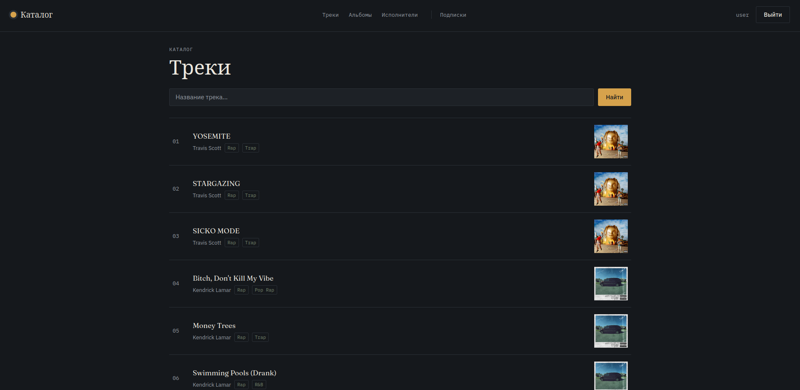
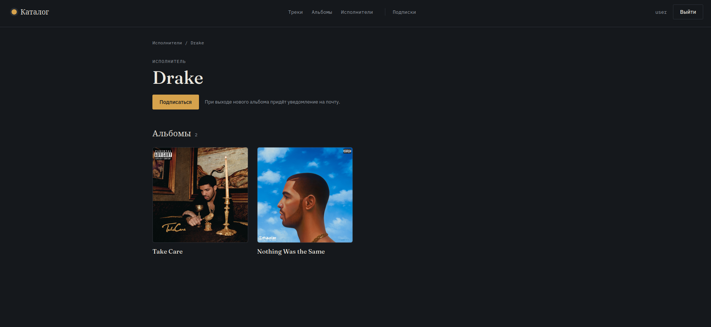
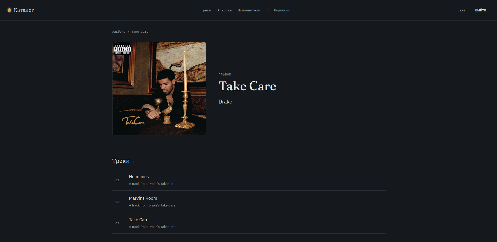

# Yii Music Catalog

Полноценный музыкальный каталог с REST API и React frontend.

Проект разработан на **Yii2 + PHP** с использованием **React, Docker и MariaDB**.

## Возможности

* Регистрация и авторизация пользователей
* Подтверждение email и восстановление пароля
* RBAC
* Исполнители, альбомы, треки и жанры
* Поиск и пагинация
* Подписки на исполнителей
* Загрузка изображений
* Файловое хранилище MinIO
* Фоновые задачи через Yii Queue
* REST API
* Отдельные development и production окружения

## Скриншоты

### Каталог



### Страница исполнителя



### Страница альбома



## Стек

**Backend**

* PHP 8.2
* Yii2
* MariaDB
* Yii Queue
* Symfony Mailer

**Frontend**

* React 18
* Vite
* React Router
* Nginx

**Infrastructure**

* Docker / Docker Compose
* Apache
* MinIO
* MailHog

## Архитектура

```text
Browser
   │
   ▼
React + Nginx
   │ /api/*
   ▼
Yii2 + Apache
   │
   ├── MariaDB
   ├── MinIO
   └── Yii Queue
```

В production frontend Nginx проксирует `/api/*` запросы к backend.

## Запуск

### Development

Требуется только Docker.

```bash
git clone <repository-url>
cd yii-music-catalog

cp .env.dev.example .env.dev
```

Заполните значения `CHANGE_ME` в `.env.dev`, после чего:

```bash
make dev-build
```

После запуска контейнеров примените миграции:

```bash
docker compose --env-file .env.dev -f compose.dev.yml exec backend php yii migrate --interactive=0
```

После запуска:

* Frontend — `http://localhost:5173`
* Backend API — `http://localhost:8080`
* MinIO — `http://localhost:9001`
* MailHog — `http://localhost:8025`

### Production

```bash
cp .env.prod.example .env.prod
```

Заполните значения `CHANGE_ME` в `.env.prod`, после чего:

```bash
make prod-build
```

После запуска контейнеров примените миграции:

```bash
docker compose --env-file .env.prod -f compose.prod.yml exec backend php yii migrate --interactive=0
```

## API

Полная документация API находится в [`api.md`](api.md).

Пример запроса:

```http
GET /api/artists/4?expand=albums
Authorization: Bearer <token>
```

## Структура

```text
backend/        # Yii2 backend и REST API
frontend/       # React приложение
docker/         # конфигурация Docker/Apache
compose.dev.yml
compose.prod.yml
Dockerfile
Dockerfile.dev
API.md
Makefile
```

## Цель проекта

Практический full-stack проект для изучения и демонстрации разработки REST API, Yii2, React и Docker в одном приложении.
